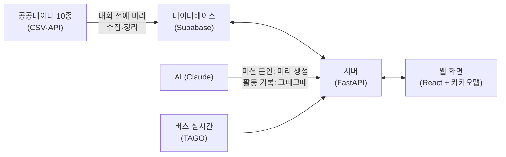

# 봄내마실 — 시스템 설계

> 개발 착수 전 필독. 기준은 하나다: **본선 30시간 안에 데모가 끝까지 도는 것.**
> 용어가 낯설면 그때그때 괄호 설명을 보면 된다. 더 깊은 배경이 궁금하면 팀 채널에서 물어볼 것.

## 1. 큰 그림



- **데이터베이스**: 데이터를 저장하는 창고. Supabase라는 무료 서비스를 쓴다 (지도 좌표 계산이 되는 PostGIS 기능 포함)
- **서버**: 화면의 요청을 받아 추천을 계산해 돌려주는 프로그램. Python으로 만든다
- **웹 화면**: 심사위원과 시민이 보는 부분. 앱 설치 없이 주소(QR)로 바로 열린다

## 2. 설계 원칙 4가지 — 왜 이렇게 만드나

1. **데이터 준비는 대회 전에 끝낸다.** 본선장에서 처음 여는 데이터가 있으면 안 된다. 10종 데이터를 미리 내려받아 정리·저장해 두고, 본선에서는 쓰기만 한다.
2. **추천하는 순간에는 AI를 부르지 않는다.** 미션 카드 문구는 (활동×가게) 조합 전부를 미리 AI로 만들어 저장해 둔다. 그래서 추천이 몇 초 안에 나오고, 인터넷이 불안해도 안 죽는다. AI를 실시간으로 부르는 곳은 "활동 기록 초안" 하나뿐이며, 같은 입력이면 저장해 둔 결과를 재사용한다.
3. **점수 계산과 퀘스트 조립은 분리된 부품이다.** 데이터 담당(R3)의 코드와 조립 담당(R4)의 코드가 서로 다른 폴더에 있고, 정해진 함수로만 연결된다. 같은 파일을 두 사람이 고칠 일이 없다.
4. **인터넷이 끊겨도 데모가 돈다.** 외부 호출(버스 실시간, AI)은 응답을 저장(캐시)해 두고, 데이터베이스 전체를 노트북에 복사해 두는 스크립트(`sync_local.sh`)를 돌린다. 시연장 와이파이가 죽으면 노트북 단독으로 완주한다.

## 3. 기술 목록

| 무엇 | 선택 | 한 줄 이유 · 주의 |
|---|---|---|
| 웹 화면 | React + 카카오맵 | 기획서에 명시. ⚠ 카카오맵 키는 등록한 주소에서만 작동 — 운영 주소와 localhost만 등록 |
| 서버 | FastAPI (Python) | 팀 전공이 Python이라 데이터 작업과 서버를 한 언어로 통일 |
| 데이터베이스 | Supabase (PostgreSQL+PostGIS) | 무료, 설치 불필요. ⚠ 접속은 반드시 "Session pooler" 주소로 (기본 주소는 배포 서버에서 안 붙는 경우 있음), 7일 안 쓰면 잠들므로 본선 전 주에 확인 |
| AI | Claude API | 미션 문구·활동 기록 생성. 교체 가능하게 어댑터 한 파일로 감싼다 |
| 배포 | 화면 Vercel / 서버 Cloudtype | 무료. ⚠ 서버가 잠들 수 있어 시연 직전 깨우기(health 호출)를 대본에 넣는다 |
| 오프라인 대비 | docker-compose | 위 전체를 노트북 한 대에서 돌리는 예비 스택 |

## 4. 폴더 구조 = 담당자

```
frontend/                  ← R1 (화면 전부)
backend/                   ← R2 (서버·배포)
  app/services/scoring/        ← R3 (점수 계산)
  app/services/quest_builder/  ← R4 (퀘스트 조립)
  app/services/llm/            ← R4 (AI 생성)
  app/models/                  ← R2만 수정 (데이터 구조 정의 — 충돌 방지의 핵심)
pipeline/                  ← R3 (데이터 수집·정리)
docs/                      ← 이 문서들
```

## 5. 데이터는 세 덩어리로 저장한다

**① 원천 데이터** — 공공데이터 10종을 정리해 넣은 것 (활동, 가게, 버스, 인구). 파이프라인이 채우고, 서버는 읽기만 한다.

**② 미리 계산해 둔 것** — 이 서비스의 심장. 셋 다 R3가 대회 전에 배치(일괄 계산)로 만든다:
- **접근성 점수표**: "이 동네에서 이 활동 장소까지" 조합마다 점수 + **타야 할 버스 번호·승하차 정류장·소요 시간**까지 미리 계산. 환승 없이 갈 수 있는지(무환승) 판별도 여기서만 한다 — **다른 코드는 이 표를 조회만 한다** (같은 계산을 두 군데서 하면 반드시 어긋난다)
- **미션 문안**: (활동×가게) 조합별 AI 생성 문구
- **대시보드 지도 데이터**: 접근성 히트맵, 저유입 상권 위치

**③ 사용자 데이터** — 세션(닉네임+만14세 확인만, 개인정보 없음), 퀘스트, 스탬프, 기록. QR·코드 스탬프는 "방문" 지표, 영수증 스탬프(금액 입력)는 "소비" 지표로 구분해 센다.

## 6. 추천이 만들어지는 과정

```
입력(관심사·동네·시간·예산)
→ ① 오늘 가능한 활동 후보 찾기 (신청형은 접수 마감 전만)
→ ② 걸러내기: 버스로 갈 수 있나 / 시간 안에 되나 / 예산 안인가
→ ③ 활동 장소 근처의 가게 찾기 — 손님 덜 드는 가게 우선
     (근처에 가게가 없으면 가게 없는 퀘스트로 추천 — 빈 화면 방지)
→ ④ 접근성 점수표에서 버스 경로 붙이기 (+실시간 도착 정보)
→ ⑤ 5가지 점수 합산 → 상위 3장을 카드로
```

②의 걸러내기 4종과 ③의 대체 추천은 R4 소유, ④의 점수표와 ⑤의 점수 계산은 R3 소유다.

## 7. 서버 기능 목록 (API 11개)

> API = 화면이 서버에게 일을 시키는 창구. 상세 형식은 `30-api-contract.md`에서 확정·동결한다.

| 기능 | 설명 | 담당 |
|---|---|---|
| 세션 만들기 | 닉네임(선택) + 만14세 확인 | R2 |
| 세션 삭제 | 내 퀘스트·스탬프·기록까지 한 번에 삭제 (삭제권 보장) | R2 |
| 퀘스트 추천 | 입력 → 카드 3장 | R2+R4+R3 |
| 퀘스트 상세 | 카드 하나의 전체 정보 | R2 |
| 미션 인증 | QR / 4자리 코드 / 영수증(+금액) → 스탬프 | R2 |
| 기록 생성 | 문답 → AI 초안 | R2+R4 |
| 기록 목록 | 보관함 | R2 |
| 대시보드 지도 2종 | 접근성 히트맵 / 저유입 상권 | R3+R2 |
| 대시보드 성과 숫자 | 전환율·저유입 비중 등 실시간 집계 (성과 목표를 데모로 입증) | R2 |
| 상태 확인 | 서버 살아있나 (health) | R2 |

## 8. 데모가 죽지 않게 하는 장치

| 위험 | 대비 |
|---|---|
| 시연장 인터넷 끊김 | 노트북 단독 스택 + `sync_local.sh`로 데이터까지 통째로 복사 (통합2 직후·리허설 직후 실행) |
| 버스 실시간 API 장애 | 저장해 둔 응답으로 재생 (`CACHE_ONLY` 스위치). 승인이 안 나면 시간표 기반으로 대체 |
| AI 장애 | 미션 문안은 애초에 미리 생성됨. 활동 기록은 저장분 재생 + 템플릿 대체 |
| 추천 결과가 빈 화면 | 걸러내기를 단계적으로 완화 + 상시 개방 활동으로 대체 |
| QR 카메라가 안 열림 | 4자리 코드 입력으로 진행 (오프라인 데모는 처음부터 코드 방식) |

## 9. 일정

**대회 전 (P0 — 이슈로 등록돼 있음)**: 키 4종 발급(TAGO는 승인 대기가 있어 최우선), 데이터 10종 적재 완주 1회, 계약 문서 동결, 화면·조립 스파이크 검증, 스켈레톤 배포(화면↔서버↔DB 연결 확인 — 배선 문제를 본선 전에 소진).

**본선 30시간 — 통합 게이트 중심**:

| 시점 | 목표 |
|---|---|
| H0~2 | 전원 환경 켜고 확인 |
| H2~10 | 각자 레인에서 병렬 개발 (역할별 상세는 `20-team.md`) |
| **H10~12 통합1** | 실데이터로 추천 카드 3장이 화면에 뜬다 |
| H12~20 | 병렬 개발 2차 (상세·인증·기록·대시보드) |
| **H20~24 통합2** | 입력→기록 저장까지 전체 완주 + 리허설 1차 + 로컬 복사 |
| H24~28 | 다듬기 + 발표 자료 |
| H28~30 | 리허설 (온라인 1회 + 오프라인 1회) + 발표 연습 |

통합 시간에는 **전원이 하던 일을 멈추고 통합에만 붙는다.** 해커톤이 무너지는 곳은 기능 개발이 아니라 통합이다.
