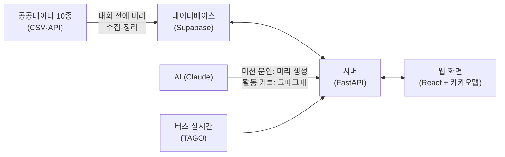

# 봄내마실 — 시스템 설계

> 개발 착수 전 필독. 기준은 하나다: **본선 30시간 안에 데모가 끝까지 도는 것.**
> 용어가 낯설면 그때그때 괄호 설명을 보면 된다. 더 깊은 배경이 궁금하면 팀 채널에서 물어볼 것.

## 1. 큰 그림



- **데이터베이스**: 데이터를 저장하는 창고. Supabase라는 무료 서비스를 쓴다 (지도 좌표 계산이 되는 PostGIS 기능 포함)
- **서버**: 화면의 요청을 받아 추천을 계산해 돌려주는 프로그램. Python으로 만든다
- **웹 화면**: 심사위원과 시민이 보는 부분. 앱 설치 없이 주소(QR)로 바로 열린다

## 2. 설계 원칙 4가지 — 왜 이렇게 만드나

1. **데이터 준비는 대회 전에 끝낸다.** 본선장에서 처음 여는 데이터가 있으면 안 된다. 10종 데이터를 미리 내려받아 정리·저장해 두고, 본선에서는 쓰기만 한다.
2. **추천하는 순간에는 AI를 부르지 않는다.** 미션 카드 문구는 (활동×가게) 조합 전부를 미리 AI로 만들어 저장해 둔다. 그래서 추천이 몇 초 안에 나오고, 인터넷이 불안해도 안 죽는다. AI를 실시간으로 부르는 곳은 "활동 기록 초안" 하나뿐이며, 같은 입력이면 저장해 둔 결과를 재사용한다.
3. **점수 계산과 퀘스트 조립은 분리된 부품이다.** 데이터 담당(R3)의 코드와 조립 담당(R4)의 코드가 서로 다른 폴더에 있고, 정해진 함수로만 연결된다. 같은 파일을 두 사람이 고칠 일이 없다.
4. **인터넷이 끊겨도 데모가 돈다.** 외부 호출(버스 실시간, AI)은 응답을 저장(캐시)해 두고, 데이터베이스 전체를 노트북에 복사해 두는 스크립트(`sync_local.sh`)를 돌린다. 시연장 와이파이가 죽으면 노트북 단독으로 완주한다.

## 3. 기술 목록

| 무엇 | 선택 | 한 줄 이유 · 주의 |
|---|---|---|
| 웹 화면 | React + 카카오맵 | 기획서에 명시. ⚠ 카카오맵 키는 등록한 주소에서만 작동 — 운영 주소와 localhost만 등록 |
| 서버 | FastAPI (Python) | 팀 전공이 Python이라 데이터 작업과 서버를 한 언어로 통일 |
| 데이터베이스 | Supabase (PostgreSQL+PostGIS) | 무료, 설치 불필요. ⚠ 접속은 반드시 "Session pooler" 주소로 (기본 주소는 배포 서버에서 안 붙는 경우 있음), 7일 안 쓰면 잠들므로 본선 전 주에 확인 |
| AI | Claude API | 미션 문구·활동 기록 생성. 교체 가능하게 어댑터 한 파일로 감싼다 |
| 배포 | 화면 Vercel / 서버 Cloudtype | 무료. ⚠ 서버가 잠들 수 있어 시연 직전 깨우기(health 호출)를 대본에 넣는다 |
| 오프라인 대비 | docker-compose | 위 전체를 노트북 한 대에서 돌리는 예비 스택 |

## 4. 폴더 구조 = 담당자

```
frontend/                  ← R1 (화면 전부)
backend/                   ← R2 (서버·배포)
  app/services/scoring/        ← R3 (점수 계산)
  app/services/quest_builder/  ← R4 (퀘스트 조립)
  app/services/llm/            ← R4 (AI 생성)
  app/models/                  ← R2만 수정 (데이터 구조 정의 — 충돌 방지의 핵심)
pipeline/                  ← R3 (데이터 수집·정리)
docs/                      ← 이 문서들
```

## 5. 데이터는 세 덩어리로 저장한다

**① 원천 데이터** — 공공데이터 10종을 정리해 넣은 것 (활동, 가게, 버스, 인구). 파이프라인이 채우고, 서버는 읽기만 한다.

**② 미리 계산해 둔 것** — 이 서비스의 심장. 셋 다 R3가 대회 전에 배치(일괄 계산)로 만든다:
- **접근성 점수표**: "이 동네에서 이 활동 장소까지" 조합마다 점수 + **타야 할 버스 번호·승하차 정류장·소요 시간**까지 미리 계산. 환승 없이 갈 수 있는지(무환승) 판별도 여기서만 한다 — **다른 코드는 이 표를 조회만 한다** (같은 계산을 두 군데서 하면 반드시 어긋난다)
- **미션 문안**: (활동×가게) 조합별 AI 생성 문구
- **대시보드 지도 데이터**: 접근성 히트맵, 저유입 상권 위치

**③ 사용자 데이터** — 세션(닉네임+만14세 확인만, 개인정보 없음), 퀘스트, 스탬프, 기록. QR·코드 스탬프는 "방문" 지표, 영수증 스탬프(금액 입력)는 "소비" 지표로 구분해 센다.

### 5-1. 퀘스트의 생애주기 (상태 모델)

퀘스트 하나는 네 상태를 지난다. **DB·화면·성과 집계가 전부 이 정의 하나를 쓴다** (여섯 군데서 각자 정의하면 반드시 어긋난다):

```
recommended (카드로 노출됨)
 → started  (상세 화면의 "퀘스트 시작" 버튼 — 시작 시각 기록)
 → stamped  (미션 인증 성공 — 스탬프 적립)
 → recorded (활동 기록 저장 = 완료)
```

- **동시 진행은 1개.** 새 퀘스트를 시작하려 하면 확인 창을 띄우고, 진행하면 기존 건은 중단(abandoned) 처리
- **기록은 인증과 독립** — 스탬프 없이도 기록을 쓸 수 있다(보관함에 "인증 없음" 표시). 가게 없는 퀘스트는 인증을 건너뛰고 기록으로 직행(스탬프 없음)
- 홈의 "이어하기" 배너 = 가장 최근 started 1건
- **방문 전환율의 정의 = stamped ÷ (가게 미션이 있는 started)** — 대시보드 성과 숫자가 이걸 쓴다
- status·started_at 필드는 계약 문서(30-api-contract) 동결 대상
- **포인트 적립은 상태 전이에 정확히 걸린다**: stamped +50, recorded +30, 완주(둘 다) +20 — 원장 테이블(point_ledger: session_id, quest_id, delta, reason) 1개에 기록, 100점 도달 시 칭호 자동 해금. 재추천은 무료(포인트와 무관)

## 6. 추천이 만들어지는 과정

```
입력(관심사·동네·시간·예산)
→ ① 오늘 가능한 활동 후보 찾기 (신청형은 접수 마감 전만)
→ ② 걸러내기: 버스로 갈 수 있나 / 시간 안에 되나 / 예산 안인가
→ ③ 활동 장소 근처의 가게 찾기 — 손님 덜 드는 가게 우선
     (근처에 가게가 없으면 가게 없는 퀘스트로 추천 — 빈 화면 방지)
→ ④ 접근성 점수표에서 버스 경로 붙이기 (+실시간 도착 정보)
→ ⑤ 5가지 점수 합산 → 상위 3장을 카드로
```

②의 걸러내기 4종과 ③의 대체 추천은 R4 소유, ④의 점수표와 ⑤의 점수 계산은 R3 소유다.

### 6-1. 경로는 이렇게 정해진다 (버스 추천의 실제 규칙)

전제: 우리 데이터에는 "몇 시 몇 분에 버스가 온다"는 **시각표가 없다.** 있는 것은 정류장 위치·정류장별 경유 노선(CSV), 노선별 배차간격·첫차·막차, 실시간 도착정보(TAGO). 그래서 경로는 시각표 계산이 아니라 3단계로 만든다:

1. **어느 정류장에서 타나** — 출발 동네의 여러 정류장 중, 그 활동 장소 기준 접근성 점수(도보거리+노선 수+배차간격)가 가장 좋은 정류장. 단순히 제일 가까운 정류장이 아니다 — 가깝지만 하루 3번 오는 정류장보다 5분 더 걸어도 10분마다 오는 정류장이 이길 수 있다
2. **어느 버스를 타나** — 승차 정류장과 활동지 근처 정류장을 같은 노선이 지나는지(**무환승**)를 대회 전에 전부 미리 계산해 둔다(접근성 점수표). 후보가 여럿이면 도보+대기+승차 합계 최단 노선. 환승이 필요한 조합은 추천에서 제외한다 — "추천한 경로는 100% 실행 가능"이라는 성과 목표의 근거
3. **시간이 맞나 — 현재 시간이 개입하는 지점**: 사용자의 가능 시간 창에 [도보 + 예상 대기 + 승차 + 활동 시간]이 들어가는지 확인(예상 대기 = 배차간격의 절반), 활동 종료가 그 노선 막차 이전인지 확인. 카드에는 TAGO 실시간 도착("300번, 7분 후 도착")을 얹어 보여주되, 이것은 **표시용 보조 정보**다 — 경로 선택은 사전 계산이 한다

카드에 적히는 것: "석사동 정류장에서 300번, 약 12분 간격, 25분 소요 (지금 7분 후 도착)". **"13시 42분 버스를 타세요" 같은 분 단위 시각표 안내는 하지 않는다** — 시각표 데이터가 없는데 흉내 내면 시연 중에 어긋난다. 시간대별 승하차 CSV는 경로 계산이 아니라 수요·상권 분석에 쓴다.

**시간 판정의 공통 규칙 (전 코드 공통):**

- 코드 어디서도 현재 시각을 직접 읽지 않는다 — R2가 주는 **기준 시각 유틸 하나**만 쓴다. 기준 시각 = 환경변수 `DEMO_NOW`가 있으면 그 값, 없으면 실제 시각. **본선 통합(H20~24)과 리허설(H28)은 전부 심야라, 이 스위치가 없으면 "오늘 가능한 활동"이 0건이 되어 테스트 자체가 안 된다.** 데모 대본의 기준 시각은 8.1(토) 14:00 고정
- 시작 시각이 정해진 활동: [기준 시각 + 도보 + 예상 대기 + 승차] ≤ 시작 10분 전이어야 후보. 상시·기간형 활동: 종료 60분 전까지 후보
- 종료가 시작보다 빠른 이상 데이터는 적재 때 23:59로 보정
- 캐시 재생 모드의 도착 문구는 "지금 N분 후"가 아니라 "약 N분 간격 운행" — 거짓 실시간 표시 금지

### 6-2. 카드 순위는 이렇게 매겨진다 (5지표 계산 규칙)

추천 기준은 두 층이다. **하드 필터(6장의 걸러내기)는 자격 심사** — 못 가는 곳, 시간·예산 밖, 접수 마감은 아예 후보에서 빠진다. **5지표 점수는 자격을 통과한 후보들의 순위** — 상위 3장이 카드가 된다. 각 지표의 계산 규칙:

| 지표 (가중치) | 계산 규칙 |
|---|---|
| 상권 기여 (30%) | 미션 가게가 **손님이 덜 드는 곳일수록 높다.** 이용자 실태 데이터에서 저유입으로 확인된 가게 = 높은 점수 / 실태 데이터에 아예 없는 가게 = "측정 이력 없음"이라 저유입으로 **추정만** 하고 중간 점수(데이터 없음을 저유입 확정으로 취급하지 않는 편향 방지 원칙) / 붐비는 가게 = 낮은 점수 |
| 관심사 맞춤 (25%) | 1차: 사용자가 고른 관심사 키워드와 활동 분류의 **규칙 매칭** (확실히 동작하는 방식). 2차(시간 남으면): 문장 의미 유사도(임베딩)로 정렬을 정교화 — 기획서에 1차/2차로 명시된 그대로 |
| 버스 접근성 (20%) | 접근성 점수표(6-1) 조회 — 도보거리·노선 수·배차간격의 종합. 요청 순간에 계산하지 않고 미리 계산해 둔 값을 읽는다 |
| 시간 적합 (15%) | 가능 시간 창 대비 [이동+활동] 소요의 **여유율.** 꽉 끼는 일정은 낮고, 여유 있는 일정이 높다 |
| 예산 적합 (10%) | 예산 대비 [활동비+미션 소비 예상액]. 예산을 넘지 않으면서 알차게 쓰는 조합이 높다 |

**왜 상권 기여가 1등 가중치인데 사용자 경험이 안 망가지나** — 심사에서 반드시 나올 질문이다. 답: 자격(갈 수 있고, 시간·예산 맞고, 관심사 매칭도 25%로 반영)은 하드 필터와 나머지 지표가 보장하고, 상권 30%는 **자격을 갖춘 후보끼리의 순위에서 저유입 가게 쪽을 앞세우는** 역할만 한다. 사용자에게 나쁜 카드를 억지로 미는 게 아니라, 좋은 카드가 여럿일 때 골목에 유리한 쪽을 고르는 것 — 이게 "시민 편의와 상권 살리기를 한 점수 체계에 넣었다"는 기획의 실체다.

## 7. 서버 기능 목록 (API 11개)

> API = 화면이 서버에게 일을 시키는 창구. 상세 형식은 `30-api-contract.md`에서 확정·동결한다.

| 기능 | 설명 | 담당 |
|---|---|---|
| 세션 만들기 | 닉네임(선택) + 만14세 확인 | R2 |
| 세션 삭제 | 내 퀘스트·스탬프·기록까지 한 번에 삭제 (삭제권 보장) | R2 |
| 퀘스트 추천 | 입력 → 카드 3장 | R2+R4+R3 |
| 퀘스트 상세 | 카드 하나의 전체 정보 | R2 |
| 미션 인증 | QR / 4자리 코드 / 영수증(+금액) → 스탬프 | R2 |
| 기록 생성 | 문답 → AI 초안 | R2+R4 |
| 기록 목록 | 보관함 | R2 |
| 대시보드 지도 2종 | 접근성 히트맵 / 저유입 상권 | R3+R2 |
| 대시보드 성과 숫자 | 전환율·저유입 비중 등 실시간 집계 (성과 목표를 데모로 입증) | R2 |
| 상태 확인 | 서버 살아있나 (health) | R2 |

## 8. 데모가 죽지 않게 하는 장치

| 위험 | 대비 |
|---|---|
| 시연장 인터넷 끊김 | 노트북 단독 스택 + `sync_local.sh`로 데이터까지 통째로 복사 (통합2 직후·리허설 직후 실행) |
| 버스 실시간 API 장애 | 저장해 둔 응답으로 재생 (`CACHE_ONLY` 스위치). 승인이 안 나면 시간표 기반으로 대체 |
| AI 장애 | 미션 문안은 애초에 미리 생성됨. 활동 기록은 저장분 재생 + 템플릿 대체 |
| 추천 결과가 빈 화면 | 걸러내기를 단계적으로 완화 + 상시 개방 활동으로 대체 |
| QR 카메라가 안 열림 | 4자리 코드 입력으로 진행 (오프라인 데모는 처음부터 코드 방식) |
| 심야 통합·리허설에 "오늘 활동" 0건 | `DEMO_NOW` 기준 시각 스위치로 시연 시점(토 14:00) 고정 (6-1 시간 판정 규칙) |

## 9. 일정

**대회 전 (P0 — 이슈로 등록돼 있음)**: 키 4종 발급(TAGO는 승인 대기가 있어 최우선), 데이터 10종 적재 완주 1회, 계약 문서 동결, 화면·조립 스파이크 검증, 스켈레톤 배포(화면↔서버↔DB 연결 확인 — 배선 문제를 본선 전에 소진).

**본선 30시간 — 통합 게이트 중심**:

| 시점 | 목표 |
|---|---|
| H0~2 | 전원 환경 켜고 확인 |
| H2~10 | 각자 레인에서 병렬 개발 (역할별 상세는 `20-team.md`) |
| **H10~12 통합1** | 실데이터로 추천 카드 3장이 화면에 뜬다 |
| H12~20 | 병렬 개발 2차 (상세·인증·기록·대시보드) |
| **H20~24 통합2** | 입력→기록 저장까지 전체 완주 + 리허설 1차 + 로컬 복사 |
| H24~28 | 다듬기 + 발표 자료 |
| H28~30 | 리허설 (온라인 1회 + 오프라인 1회) + 발표 연습 |

통합 시간에는 **전원이 하던 일을 멈추고 통합에만 붙는다.** 해커톤이 무너지는 곳은 기능 개발이 아니라 통합이다.
