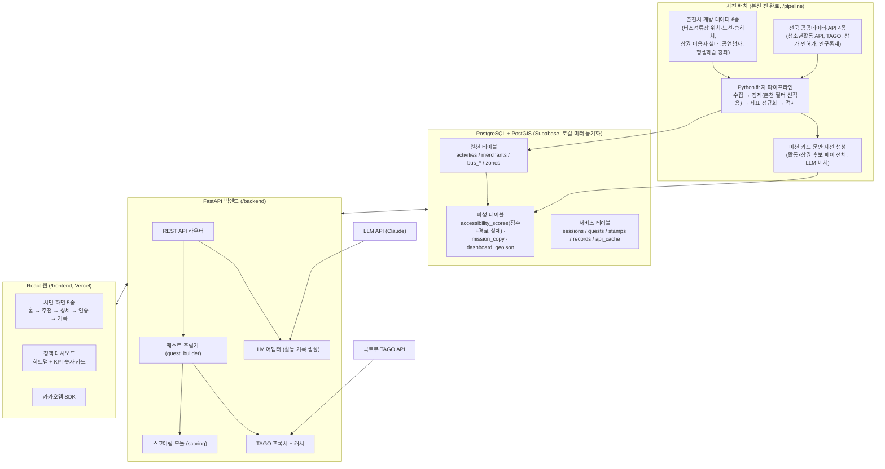

# 봄내마실 시스템 아키텍처 v1.1

> 팀 마사모 · 2026 춘천시 데이터 활용 해커톤 본선 (7.31~8.1, 무박 2일)
> 기준 문서: 제출 개발기획서 (지정과제③ 생활권 기반 지역경제 활성화 서비스)
> v1.1: 적대적 리뷰(아키텍처·역할충돌·기획서 정합성 3방향) 반영판

이 문서는 **본선 30시간 안에 E2E 데모가 도는 것**을 최우선으로 설계되었다.
모든 설계 판단의 기준: ① 기획서에서 약속한 MVP 흐름의 완주, ② 4인 병렬 작업 시 충돌 최소화, ③ 시연장 네트워크 장애에도 죽지 않는 데모.

---

## 1. 전체 구조



핵심 원칙 4가지:

1. **배치는 본선 전에 끝낸다.** 10종 데이터의 수집·정제·적재는 사전 작업이다. 본선 당일 처음 여는 데이터는 없어야 한다. 기획서대로 시연일 기준 스냅샷을 쓴다(일 1회 배치는 이관 후 운영 모드).
2. **추천 경로에서 LLM을 호출하지 않는다.** 미션 카드 문안은 (활동×상권) 후보 페어 전체에 대해 **사전 배치로 미리 생성해 DB에 적재**한다. recommend 응답은 DB 조회만으로 완성돼 "수 초 이내" 약속이 지켜지고, 오프라인에서도 완주된다. 요청 시 LLM은 활동 기록 생성 한 곳뿐이며 콘텐츠 해시로 캐싱한다.
3. **스코어링과 조립은 순수 Python 모듈이다.** `scoring`(R3)과 `quest_builder`(R4)는 FastAPI와 독립된 모듈로 작성한다. **무환승 도달 판별은 R3의 사전계산이 단일 원천**이고 R4는 조회·조립만 한다 — 같은 로직이 두 곳에 존재하지 않는다.
4. **폴백은 데이터까지 폴백이다.** 외부 API(TAGO·LLM)는 캐시를 깔고, Supabase는 pg_dump로 로컬 미러에 주기 동기화한다. "노트북 단독 완주"는 코드가 아니라 **데이터가 로컬에 있어야** 성립한다.

---

## 2. 기술 스택과 선정 이유

| 계층 | 선택 | 이유 · 주의점 |
|---|---|---|
| 프론트 | React 18 + Vite + TypeScript | 기획서 명시(React). Vite는 셋업 제로에 가깝고 빠름 |
| 지도 | 카카오맵 JavaScript SDK | 기획서 명시. ⚠ JS 키는 도메인 등록제 — **프로덕션 도메인 + localhost만 등록**하고, 매번 서브도메인이 바뀌는 Vercel 프리뷰 배포에서는 지도가 빈 화면임을 팀 전체가 인지할 것 |
| 백엔드 | FastAPI (Python 3.11+) | 팀 전공(AI빅데이터)이 Python — 파이프라인·스코어링·API를 한 언어로 통일 |
| DB | PostgreSQL 15 + PostGIS (Supabase) | 기획서 명시(PostGIS). ⚠ 무료 티어 함정 2개: ① direct connection(5432)은 IPv6 전용이라 Cloudtype에서 접속 실패 가능 → **Session pooler(IPv4) URI 사용**, transaction pooler를 쓸 경우 asyncpg `statement_cache_size=0` + NullPool을 백엔드 템플릿에 선반영. ② 7일 미사용 시 프로젝트 일시정지 — 본선 직전 주 활성 확인 |
| 스코어링 | pandas + GeoPandas + SQL | 배치 계산은 pandas, 요청 시 계산은 PostGIS 공간 질의 |
| LLM | Claude API (어댑터 패턴으로 교체 가능) | 미션 카드 문안(사전 배치)·활동 기록 초안(요청 시). 한국어 문장 품질과 시스템 프롬프트 통제 용이 |
| 배포 | FE Vercel / BE Cloudtype / DB Supabase | 전부 무료 티어, QR로 즉시 접속 시연. ⚠ Cloudtype 콜드스타트 대비 시연 직전 `/api/health` 웜업을 데모 대본에 포함 |
| 로컬 폴백 | docker-compose (postgres+postgis, backend, frontend) + **pg_dump 동기화 스크립트** | 시연장 네트워크 장애 시 노트북 단독 완주. FE의 API base URL은 env 스위치 1개로 전환 |
| 협업 | GitHub 모노레포 + GitHub Projects 칸반 | 데이터 스냅샷은 git-lfs 대신 **드라이브 공유 + .gitignore**로 확정 (전원 lfs 설정·무거운 clone 회피) |

---

## 3. 저장소 구조 (모노레포)

```
bomnae-masil/
├── frontend/                  # R1 소유
│   ├── src/
│   │   ├── pages/             # Home, Recommend, Detail, Verify, Archive, Dashboard
│   │   ├── components/        # QuestCard, MapView, StampBoard, RecordEditor ...
│   │   ├── api/               # API 클라이언트 (mocks/ 포함 — 계약 기반 목데이터)
│   │   └── styles/
├── backend/                   # R2 소유 (app/services 하위는 R3·R4 소유)
│   ├── app/
│   │   ├── routers/           # sessions, quests, missions, records, dashboard, health
│   │   ├── services/
│   │   │   ├── scoring/       # R3 소유 — 접근성·상권기여·가중합·무환승 판별 (순수 모듈)
│   │   │   ├── quest_builder/ # R4 소유 — 후보 결합·하드 필터·카드 조립
│   │   │   └── llm/           # R4 소유 — 프롬프트·어댑터·폴백 템플릿
│   │   ├── models/            # SQLAlchemy 모델 + Pydantic 스키마 (R2 단일 관리)
│   │   ├── cache/             # TAGO·LLM 응답 캐시
│   │   └── main.py
│   └── tests/                 # 최소: recommend E2E 스모크 1본
├── pipeline/                  # R3 소유
│   ├── ingest/                # 데이터셋별 수집 (10종 각 1파일) — 대용량은 ingest 단계에서 춘천 필터
│   ├── transform/             # 정제·좌표 정규화·필터(종료 행사 제거)
│   ├── load/                  # PostGIS 적재 + 파생 테이블 + 미션 문안 사전 생성 + sync_local.sh(pg_dump→로컬 restore)
│   └── snapshots/             # 원본 CSV (.gitignore — 드라이브 공유)
├── docs/
│   ├── ARCHITECTURE.md        # 본 문서
│   ├── TEAM_ROLES.md
│   ├── API_CONTRACT.md        # ★ Day 0 동결 대상 (QR 토큰 포맷·실패 응답 포함)
│   └── DEMO_SCENARIO.md       # 데모 대본 + 탐색 3분 타이머 연출 + 웜업 절차
├── docker-compose.yml         # 로컬 폴백 스택
└── .github/                   # PR 템플릿
```

소유권 규칙: **디렉토리 = 담당자.** 다른 사람 디렉토리는 PR로만 수정 요청. `models/`와 `API_CONTRACT.md`만 R2가 단일 창구로 관리한다(스키마 충돌 방지의 핵심).

> ⚠ 상가·인허가 원본은 전국 단위 수 GB급이다. **ingest 단계에서 춘천만 필터해 적재** — 그러지 않으면 Supabase 무료 500MB 한도를 바로 초과한다. `stop_hourly`도 필요한 기간만 적재.

---

## 4. 데이터 모델 (PostGIS)

### 4-1. 원천 테이블 (파이프라인이 적재, 서비스는 읽기 전용)

| 테이블 | 주요 컬럼 | 원천 데이터 |
|---|---|---|
| `activities` | id, type(**당일형**/**신청형**), title, category, org, place_name, geom(Point), schedule(jsonb), price, target_age, apply_deadline, source | 공연행사·문화축제, 평생학습관 강좌, 청소년활동 API |
| `merchants` | id, name, biz_category, geom(Point), status(영업/폐업), zone_code, visitor_stats(jsonb), low_inflow(bool), low_inflow_reason(`실태저유입`/`측정이력없음`), qr_code, entry_code(4자리) | 상가·인허가 데이터 ⊕ 관광지·상권 이용자 실태 |
| `bus_stops` | stop_id, name, geom(Point), node_id | 버스정류장 위치정보 |
| `routes` | route_id, name, headway_min, first_bus, last_bus | 노선정보 (+TAGO 보완, 플랜B: 정적 노선정보만으로 headway 산정) |
| `stop_routes` | stop_id, route_id, seq | 정류장별 경유 노선 |
| `stop_hourly` | stop_id, hour, boarding, alighting | 시간대별 승하차 인원 |
| `zones` | zone_code, name, geom(Polygon), pop_by_age(jsonb) | 행정동 경계 + 주민등록 인구통계 |

### 4-2. 파생 테이블 (R3 배치 산출 — 서비스와 대시보드가 공유)

| 테이블 | 내용 |
|---|---|
| `accessibility_scores` | (출발 정류장 × 활동 장소) **점수 + 경로 실체**: score, no_transfer(bool), **best_route_id, board_stop_id, alight_stop_id, walk_min, duration_min**, headway_min. **무환승 판별의 단일 원천** — R4는 이 테이블을 조회만 한다 |
| `mission_copy` | (activity_id × merchant_id) 미션 카드 문안 — LLM 사전 배치 생성. recommend 경로에서 LLM 호출 제거의 근거 |
| `dashboard_geojson` | 대시보드 산출물: ① 행정동별 접근성 히트맵 ② 저유입 상권 포인트 ③ (여유 시) 사각지대 레이어(연령별 인구 대비 활동 공급량 × 접근성) |

**행정동 오리진 환산 규칙 (Day 0 확정)**: 출발지를 행정동으로 입력한 경우, **동 내 정류장 중 해당 활동에 대한 접근성 점수가 최고인 정류장**으로 환산한다. 규모: (정류장 약 1,000여 개 + 행정동 25) × 활동 장소 수백 = 수십만 행 — 정류장×정류장 무환승 매트릭스를 먼저 만들고 조인하는 방식으로 배치 계산하며, **사전 준비 기간에 1회 완주해 소요시간을 실측**한다.

### 4-3. 서비스 테이블 (R2 소유)

| 테이블 | 내용 |
|---|---|
| `sessions` | id(uuid), nickname(선택), **age_confirmed(bool, 필수)** — 만 14세 이상 확인(기획서 3-5). 그 외 개인정보 없음 |
| `quests` | id, session_id, activity_id, merchant_id, route(jsonb), score_breakdown(jsonb), budget_total, status(`추천`/`완료`) — '진행' 상태 없음: verify 성공이 곧 완료 |
| `stamps` | id, session_id, quest_id, method(`qr`/`code`/`receipt`), **spend_amount(nullable — 영수증 시 수기 입력)**, verified(bool — 영수증은 false로 적립, OCR 검증은 고도화), payload_ref, verified_at |
| `records` | id, session_id, quest_id, answers(jsonb), draft_md, created_at |
| `api_cache` | key(**콘텐츠 해시**), source(`tago`/`llm`), response(jsonb), fetched_at |

> **지표 매핑 (기획서 5-1 약속)**: `qr`·`code` 스탬프 = **방문 지표**, `receipt` 스탬프(spend_amount) = **소비 지표**. 대시보드 KPI가 이 구분을 그대로 집계한다.

---

## 5. 핵심 로직 설계

### 5-1. 퀘스트 스코어링 (R3, `services/scoring/`)

기획서 약속: **5개 지표 가중합, 지역상권 활성화 기여도 최대 가중 30%.**

```
quest_score = 0.30 × 상권기여 + 0.25 × 관심사매칭 + 0.20 × 접근성 + 0.15 × 시간적합 + 0.10 × 예산적합
```

- **상권기여**: 미션 상권이 저유입일수록 높음. `low_inflow_reason=측정이력없음`은 보수적 추정 후보로 실태 저유입보다 낮은 점수 (기획서의 편향 방지 원칙)
- **관심사매칭**: 1차 = 관심 키워드-카테고리 규칙 매칭 (동작 보장). 2차 = 텍스트 임베딩 유사도 정렬 고도화 — **시간 남을 때만** (기획서에 1차/2차로 명시된 그대로)
- **접근성**: `accessibility_scores` 사전 산출 조회 (요청 시 계산 아님)
- **시간적합·예산적합**: 가능 시간 창 대비 활동 소요+이동시간, 예산 대비 활동비+미션 소비액

R3의 소유 범위: 위 산식 + `accessibility_scores` 배치(무환승 판별 포함). **퀘스트 성립 조건(하드 필터)은 R4 소유** — 5-2 참조.

### 5-2. 퀘스트 조립 (R4, `services/quest_builder/`)

```
입력(관심사·출발지·시간·예산)
 → 활동 후보 조회(당일형/신청형, 접수 마감 전) 
 → 하드 필터 [R4 단독 소유]:
    ① 이동 실행 가능성 — accessibility_scores.no_transfer 또는 도보권 (조회만, 판별 로직은 R3 원천)
    ② 시간 창 내 완주 가능  ③ 예산 내  ④ 신청형은 apply_deadline 전
 → 활동별: 반경 내 상권 후보 클러스터링(PostGIS ST_DWithin) → 저유입 우선 선택
 → 상권 후보 없으면 경유 없는 퀘스트로 대체 (빈 결과 방지 — 기획서 3-1)
 → 경로 실체: accessibility_scores의 best_route·정류장·소요시간 사용 + TAGO 도착정보로 실시간 보완
 → scoring 호출 → 상위 3개 퀘스트 카드 반환 (mission_copy 문안 + 점수 구성 + D-day + 무환승 배지)
```

- 환승 포함 탐색은 고도화 과제 (기획서 명시 — 범위 방어에 쓸 것)
- TAGO 호출은 반드시 `api_cache` 경유 (프록시 함수 하나로 통일, R2 제공). **TAGO 활용신청 미승인 플랜B**: 정적 노선정보 headway + 거리 기반 소요시간 추정으로 대체하고 화면 문구를 "예상"으로 표기

### 5-3. LLM 생성 (R4, `services/llm/`)

| 용도 | 시점 | 입력 | 캐시 키 | 폴백 |
|---|---|---|---|---|
| 미션 카드 문안 | **사전 배치** (`mission_copy` 적재) | 활동·상권 메타(익명) | — (사전 생성이라 불필요) | 템플릿 문자열 조합 |
| 활동 기록 초안 | 요청 시 | 퀘스트 메타 + 문답 답변 | **hash(prompt_name, quest 메타, answers)** — quest_id 아님(매 추천마다 신규 발급되므로 캐시 키로 쓸 수 없음) | 문답 답변을 정형 템플릿에 삽입 |

- 활동 기록은 페르소나별(학생=포트폴리오, 성인=아카이브, 시니어=배움일지)
- **식별정보(이름·소속) LLM 미전송** — 어댑터 단에서 허용 필드 화이트리스트로 강제 (기획서 3-5)
- 리허설에서 데모 시나리오의 문답 조합으로 캐시를 채우면, 본 시연에서 동일 입력 → 캐시 적중으로 재생됨 (콘텐츠 해시라 성립)
- 어댑터 패턴: `generate(prompt_name, payload) → text`. 프로바이더 교체·목 응답 주입이 한 파일로 끝나게

### 5-4. 미션 인증 (R2 + R1)

| 방식 | 지표 | MVP 범위 |
|---|---|---|
| `qr` — 가맹점 QR 스캔 | 방문 | 데모 주력. QR = merchant_id + HMAC 서명 토큰. 스캔 merchant ≠ quest.merchant면 명시적 실패 응답 (토큰 포맷·실패 코드는 API_CONTRACT.md에 정의) |
| `code` — 점포 비치 4자리 코드 직접 입력 | 방문 | **고령층·카메라 불가 환경용 저마찰 경로** (기획서 3-5 약속 대응). QR과 동일 검증 로직 재사용, 카메라 불필요 |
| `receipt` — 영수증 사진 업로드 + 금액 수기 입력 | **소비** | 업로드·보관 + `verified=false` 스탬프 적립까지. OCR 검증은 고도화 과제 |

- 가족 계정 공유·점포 직원 대리 등록은 **고도화 과제로 명시** — 데모 대본(R4)에 방어 멘트 포함: "저마찰 1단계로 숫자코드 입력을 구현했고, 대리 등록은 이관 시 점포 온보딩과 함께"
- ⚠ QR 카메라(getUserMedia)는 secure context 필수 — Vercel(HTTPS)·localhost는 되지만 **로컬 폴백 중 폰이 LAN IP(http)로 접속하면 카메라가 안 열린다** → 로컬 폴백 데모는 노트북 단독 + `code` 방식으로 진행 (DEMO_SCENARIO에 명시)

---

## 6. API 계약 v1 (Day 0 동결 — 상세는 `docs/API_CONTRACT.md`)

| 메서드 | 경로 | 요청 | 응답 | 담당 |
|---|---|---|---|---|
| POST | `/api/sessions` | {nickname?, **age_confirmed: true**} | {session_id} | R2 |
| **DELETE** | `/api/sessions/{id}` | — | 204 (quests·stamps·records **연쇄 삭제** — 삭제권 보장, 기획서 3-5) | R2 |
| POST | `/api/quests/recommend` | {session_id, interests[], origin{type: dong\|stop, code}, available_min, budget_krw} | {quests: [QuestCard × 3]} | R2(라우터)+R4(조립)+R3(점수) |
| GET | `/api/quests/{id}` | — | QuestDetail(활동·미션·경로·예산 합계) | R2 |
| POST | `/api/missions/{quest_id}/verify` | {method: qr\|code\|receipt, payload, spend_amount?} | {stamp, stamp_count} / 실패 코드 명시 | R2 |
| POST | `/api/records` | {quest_id, answers[]} | {record_id, draft_md} | R2(라우터)+R4(LLM) |
| GET | `/api/records?session_id=` | — | [Record] | R2 |
| GET | `/api/dashboard/accessibility` | — | GeoJSON | R3(산출)+R2(서빙) |
| GET | `/api/dashboard/inflow` | — | GeoJSON | R3(산출)+R2(서빙) |
| **GET** | `/api/dashboard/kpi` | — | {저유입_상권_추천_비중_pct, 방문_전환율_pct, 무환승_검증_통과율_pct, 소비_인증_합계_krw} — **기획서 KPI를 라이브 집계로 입증** | R2 |
| GET | `/api/health` | — | {ok, db, cache} | R2 |

`QuestCard` 스키마(요약): `{quest_id, title, mission_copy, score, score_breakdown{5개 지표}, activity{..., type, d_day(신청형 접수 마감 D-day)}, mission{merchant, task, budget}, route{stops[], route_name, duration_min, headway_min, no_transfer(bool — "환승 없음" 배지)}, budget_total}`

**계약 운영 규칙**: 본선 중 계약 변경은 R2 승인 + 단톡 공지 후에만. R1은 계약과 동일 구조의 목 JSON(`frontend/src/api/mocks/`)으로 백엔드 완성 전에도 전 화면을 개발한다. **CORS**: FastAPI CORSMiddleware에 프로덕션 도메인 + localhost 허용을 스켈레톤 단계에서 설정(교차 출처: Vercel↔Cloudtype).

---

## 7. 화면 구성 (R1, 기획서 4-3 그대로)

| # | 화면 | 핵심 요소 | 상태 |
|---|---|---|---|
| 1 | 홈 | **만 14세 이상 확인 체크 + 개인정보 최소수집 한 줄 고지(첫 진입 모달)** · 관심사 멀티선택 · 출발지(행정동/정류장 선택 — GPS 없음) · 가능 시간 · 예산 | MVP |
| 2 | 추천 | 퀘스트 카드 3종 + 점수 구성(활동/상권/이동) 미리보기 + 신청형 D-day 뱃지 + "환승 없음" 배지 | MVP |
| 3 | 상세 | 카카오맵(활동지·상권·정류장 마커, 경로선) + 버스 노선·소요시간 + 미션 + 예산 합계 | MVP |
| 4 | 수행/인증 | QR 스캔(카메라) / **4자리 코드 입력** / 영수증 업로드+금액 입력 → 완료 스탬프 보드 | MVP |
| 5 | 기록/보관함 | 간단 문답 → AI 초안 표시·수정 → 저장 목록 + **"내 기록 전체 삭제" 버튼**(DELETE /sessions) | MVP |
| 6 | 정책 대시보드 | 지도 1장(접근성 히트맵 + 저유입 상권 레이어 토글, 여유 시 사각지대 레이어) + **하단 KPI 숫자 카드 3개**(/dashboard/kpi) | MVP(범위 통제형) |

반응형(모바일 우선) — 시연은 심사위원 폰 QR 접속 + 빔 프로젝터 데스크톱 병행.

---

## 8. 시연 안정성 설계

| 리스크 | 대응 |
|---|---|
| 시연장 네트워크 장애 | docker-compose 로컬 스택 + **`sync_local.sh`(Supabase pg_dump → 로컬 restore, api_cache 포함)**. 동기화 시점: ① 사전 준비 기간 1회(로컬 E2E 완주 확인) ② 통합 2 직후 ③ H28 리허설 직후. FE는 env 스위치로 API base URL 전환. 폴백 데모는 노트북 단독 + code 인증 |
| TAGO 응답 지연·장애·미승인 | `api_cache` 재생 모드(`CACHE_ONLY=1`) + 정적 노선정보 플랜B(5-2) |
| LLM 장애·지연 | 미션 문안은 애초에 사전 생성(DB) — 무풍. 활동 기록은 콘텐츠 해시 캐시 + 템플릿 폴백. 리허설 때 데모 문답 조합으로 캐시를 미리 채움 |
| 추천 결과 빈 화면 | 하드 필터 완화 단계적 적용 + 상시 개방형 활동 대체 추천 (기획서 3-1 약속) |
| 데모 시나리오 데이터 공백 | 데모 시나리오(청년 직장인·퇴근 후 여가)의 요일·시간대에 실제 활동 존재를 **사전 데이터 검증** — 기획서 명시 방법론이므로 발표 때 강점으로 언급. **신청형(강좌) 카드 1장을 30초 보여주는 서브 시나리오 포함** (당일형만 보이면 기획서 약속 축소로 보임) |
| Cloudtype 콜드스타트 | 시연 직전 `/api/health` 웜업을 데모 대본 1번 항목으로 |
| "인증 없는 API" 질의 | 발표 방어 멘트 준비: "세션 기반 최소 수집 설계, 운영 이관 시 인증 추가" |
| "탐색 3분 이내" KPI | DEMO_SCENARIO에 화면 타이머 연출 명시 — 입력 시작~퀘스트 선택 실측을 리허설에서 계측 |

---

## 9. 사전 준비 체크리스트 (지금 ~ 7.30 — 실가용일 2~3일 기준 우선순위순)

- [ ] **P0** TAGO 활용신청 (승인 대기 있음 — 오늘 즉시) / 카카오맵 JS 키(도메인 등록) / LLM API 키 / Supabase 프로젝트 + PostGIS 활성화
- [ ] **P0** GitHub 모노레포 + 디렉토리 골격 + 브랜치 보호, 데이터 스냅샷 드라이브 공유
- [ ] **P0** 10종 데이터 스냅샷 수집·적재 파이프라인 완주 1회 (accessibility_scores 배치 소요시간 실측 포함)
- [ ] **P0** `API_CONTRACT.md` v1 동결(연령 게이트·삭제·kpi·code 인증 포함) + 목 JSON 생성
- [ ] **P0** 스켈레톤 배포 = **통합 0**: Vercel FE ↔ Cloudtype BE ↔ **Supabase Session pooler(IPv4) URI 쿼리 성공** + CORS 통과를 한 번에 검증 — 배선 문제를 본선 전에 소진
- [ ] **P1** 스킬 검증 스파이크 (TEAM_ROLES 2-1: R1 지도·QR·카드 / R4 미니 build_quests)
- [ ] **P1** `mission_copy` 사전 생성 배치 1회 / 데모 시나리오 요일·시간대 데이터 검증
- [ ] **P1** `sync_local.sh` 작성 + 로컬 docker-compose E2E 완주 1회
- [ ] **P2** 가맹점 QR + 4자리 코드 스탠드 인쇄물 3종 / 발표 슬라이드 템플릿(R4)

## 10. 본선 30시간 마일스톤

| 시간 | 통합 목표 | 비고 |
|---|---|---|
| H0~2 | 부팅 | 전원 환경 기동, health 체크, 스냅샷 최신화 |
| H2~10 | 기능 병렬 | 스윔레인은 TEAM_ROLES 4장 |
| **H10~12** | **통합 1: recommend E2E** | **진입 기준**: ① 배포 health green ② scoring v1 단위 테스트 통과 ③ recommend 라우터가 목 조립으로라도 200 반환. **실패 시**: 최대 H14까지 연장, R1은 목 유지로 상세 화면 계속 |
| H12~20 | 기능 병렬 | 대시보드 화면은 이 구간에서 목 GeoJSON으로 선개발 (H24 이후로 미루지 않음) |
| **H20~24** | **통합 2: 전체 E2E + 리허설 1차** | LLM 기록 캐시 채우기 + **sync_local.sh 실행(로컬 미러 최신화)**. 교대 수면 시작(2인 1조 90분) |
| H24~28 | 마감 | 버그픽스, UI 폴리시, KPI 카드 수치 검수, 발표 자료 완성 |
| H28~30 | 리허설 | 라이브 1회 + 캐시/로컬 폴백 1회 + **발표 연습 1회**, sync_local.sh 최종 실행 |

통합 지점에는 **전원이 자기 작업을 멈추고 통합에만 붙는다.** 해커톤이 무너지는 지점은 기능 개발이 아니라 통합이다.
