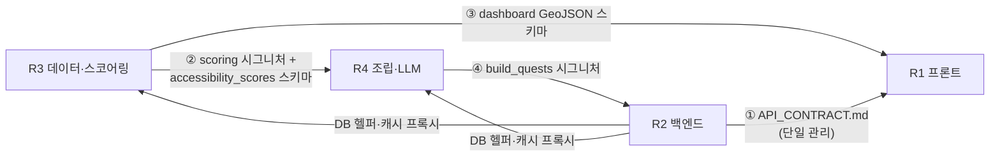

# 봄내마실 4인 역할 분담 v1.1

> 원칙: **역할 = 디렉토리 = 산출물.** 두 사람이 같은 파일을 편집하는 구조를 설계 단계에서 제거한다.
> 아키텍처 근거는 `ARCHITECTURE.md` 3장(저장소 구조)·5장(핵심 로직) 참조.
> v1.1: 적대적 리뷰 반영 — 무환승 소유권 단일화, 스파이크 검증, 백업 체계, 통합 진입 기준, 스윔레인 재배치.

---

## 0. "프론트 1 · 백엔드 1 · AI 2" 구성에 대한 결론

**방향은 맞다. 단, "AI 2명"을 같은 역할로 두면 안 된다.**

봄내마실에서 'AI 작업'은 실제로 성격이 다른 두 덩어리다:

1. **데이터·스코어링** — 10종 데이터 파이프라인, 접근성 점수(무환승 판별 포함), 저유입 상권 식별, 5지표 가중합. 본질은 데이터 엔지니어링 + 분석이며, **이 서비스의 최대 병목**이다 (데이터가 안 실리면 추천도 LLM도 대시보드도 없다).
2. **추천 조립·LLM** — 활동+상권+경로를 퀘스트로 묶는 로직, 하드 필터·빈 결과 방지, 미션 카드·활동 기록 생성.

"AI 2명"이 이 둘을 나눠 가지면 완벽한 구성이다. 반대로 역할 정의 없이 "AI는 둘이 같이"로 가면 파이프라인·스코어링·프롬프트를 서로 건드리다 머지 충돌 + 책임 공백이 생긴다 — 해커톤에서 가장 흔한 붕괴 패턴.

또 하나: **프론트 1명의 부하가 가장 크다** (시민 화면 5종 + 지도 + 대시보드 + QR 스캔). 그래서 이 문서는 ① 대시보드를 "R3가 만든 GeoJSON을 지도 1장에 얹는 것"으로 범위 통제하고 **H12~20에 선개발**하며, ② 디자인 역량이 있는 사람을 프론트에 배치하고, ③ 발표 자료는 R4가 사전 제작한 템플릿으로 부하를 분산했다.

---

## 1. 역할 카드

### R1 — 프론트엔드 & 디자인 (1명)

| 항목 | 내용 |
|---|---|
| 소유 | `frontend/` 전체 |
| 산출물 | 시민 화면 5종(연령 게이트 모달·기록 삭제 버튼 포함) + 정책 대시보드 화면(히트맵+KPI 카드), 카카오맵 연동, QR 스캔 + 4자리 코드 입력, 반응형 UI, 디자인 시스템 |
| 핵심 책임 | "응답까지 3단계 이내·수 초 이내" 사용자 목표(기획서 3-1)의 체감 품질. 시연에서 심사위원이 보는 것의 90%는 이 사람 화면이다 |
| 하지 않는 것 | API 내부 로직, DB, 점수 계산. 데이터가 이상하면 고치지 말고 R3에게 이슈로 던진다 |
| 대기 없이 일하는 법 | `API_CONTRACT.md` 기반 목 JSON으로 전 화면 선개발 → 통합 구간에 실 API로 스위치. 대시보드도 목 GeoJSON으로 H12~20에 선개발 |
| 백업 | R4 (통합 구간마다 15분 워크스루로 인수 가능 상태 유지 — 5장) |

### R2 — 백엔드 & 인프라 (1명)

| 항목 | 내용 |
|---|---|
| 소유 | `backend/` (단, `services/scoring·quest_builder·llm` 제외), `docker-compose.yml`, `sync_local.sh` 운영, 배포 전체 |
| 산출물 | REST API 11본, DB 스키마·마이그레이션, 세션(연령 확인)·스탬프(방문/소비 구분)·보관함·삭제(연쇄), KPI 집계, TAGO 프록시+캐시, Supabase·Cloudtype·Vercel 배포, 로컬 폴백 스택 |
| 핵심 책임 | **API 계약의 단일 관리자.** 계약 변경은 R2 승인으로만. `models/` 스키마 충돌의 방화벽. Supabase pooler·CORS 등 배선 검증(통합 0) |
| 하지 않는 것 | 점수 산식·프롬프트 내용에 관여하지 않는다. 조립 로직은 R4의 `build_quests`를 호출만 한다 |
| 인터페이스 | R3·R4에게 "DB 읽기 헬퍼 + 캐시 프록시 함수"를 초기에 제공 — 이후 둘은 R2 코드를 기다릴 일이 없다 |
| 백업 | R3 |

### R3 — 데이터 파이프라인 & 스코어링 (1명) ← "AI ①"

| 항목 | 내용 |
|---|---|
| 소유 | `pipeline/` 전체, `backend/app/services/scoring/`, 파생 테이블 3종(accessibility_scores·mission_copy 적재·dashboard_geojson) |
| 산출물 | 10종 데이터 적재 완주, **접근성 점수 + 무환승 판별 + 경로 실체(best_route·정류장·소요시간) 사전계산 — 단일 원천**, 저유입 상권 분류(측정이력없음 보수 분류), 5지표 가중합 함수, GeoJSON 산출 |
| 핵심 책임 | **본선 전 파이프라인 완주 1회 + accessibility_scores 배치 소요 실측** (사전 준비 최우선). 데모 시나리오 요일·시간대 활동 존재 검증 |
| 하지 않는 것 | API 라우터·화면·하드 필터(하드 필터는 R4 소유). 스코어링은 순수 함수 제공 — FastAPI를 import하지 않는다 |
| 인터페이스 | R4에게 스코어링 함수 시그니처와 accessibility_scores 스키마를, R1에게 GeoJSON 스키마를 Day 0에 확정해 준다 |
| 백업 | R2 |

### R4 — 퀘스트 조립 & LLM (1명) ← "AI ②"

| 항목 | 내용 |
|---|---|
| 소유 | `backend/app/services/quest_builder/`, `backend/app/services/llm/`, `docs/DEMO_SCENARIO.md`, 발표 자료 |
| 산출물 | **하드 필터 4종 + 빈 결과 대체 추천 (R4 단독 소유)**, 후보 결합→상위 3개 카드 조립, 미션 카드 사전 생성 배치 프롬프트, 활동 기록 프롬프트(페르소나 3종)·콘텐츠 해시 캐시·폴백 템플릿, 개인정보 화이트리스트, 데모 대본(신청형 서브 시나리오·타이머 연출·웜업 포함) |
| 핵심 책임 | 추천 품질과 생성 품질. 무환승 판별은 **R3의 accessibility_scores를 조회만** — 직접 구현 금지 (이중 구현 방지) |
| 하지 않는 것 | 점수 산식 내부(R3 함수 호출만), DB 스키마 변경(R2에 요청), 무환승 판별 로직 |
| 인터페이스 | Day 0 동결 계약 `build_quests(req) → list[QuestCard]`로 R2 라우터와 연결 (3장) |
| 백업 | R1 / 초반(H0~2) 유휴 시간에는 verify·records 등 단순 라우터를 R2에게서 인수해 부하 분산 |

---

## 2. 이름 매핑 (제안)과 스파이크 검증

### 2-0. 제안 매핑

> 신청서의 공식 역할과 실무 적합도를 겹쳐 본 제안이다. **최종 확정은 아래 2-1 스파이크 결과로 한다** — 직함이 아니라 검증된 스킬로 결정.

| 팀원 | 신청서 역할 | 제안 실무 역할 | 근거 |
|---|---|---|---|
| 김태우 | 개발자 | **R2 백엔드·인프라** | 개발 전담 포지션 — API·배포의 단일 관리자에 적합 |
| 최우혁 | 디자이너 | **R1 프론트엔드·디자인** | 화면·디자인을 한 사람이 쥐면 시연 품질이 일관됨 |
| 우영찬 | 기획자 | **R4 조립·LLM** | 프롬프트·미션 문안·데모 시나리오·발표는 기획 역량과 직결 |
| 최서준 | 팀장 | **R3 데이터·스코어링 + 총괄** | 병목(데이터)을 팀장이 쥐고 진행 판단 권한을 가짐 |

### 2-1. 스파이크 검증 (7.29까지 — 매핑 확정 조건)

R1과 R4는 "심사위원이 보는 90%"와 "절대 못 버리는 E2E 코어"를 각각 쥔다. 직함(디자이너·기획자)만 믿고 배정하면 위험하므로, 반나절 스파이크로 검증한다:

| 대상 | 스파이크 과제 (각 1~2시간 컷) | 실패 시 플랜B |
|---|---|---|
| R1 후보 | ① 목 JSON으로 추천 카드 리스트 렌더 ② 카카오맵 마커+경로선 1개 ③ QR 카메라 스캔 데모 | QR을 4자리 코드 입력으로 강등(계약에 이미 포함), 지도는 마커만. 그래도 어려우면 R1↔R4 교체 검토 |
| R4 후보 | 샘플 DB 몇 행 + 목 scoring 함수로 QuestCard 3장 JSON을 반환하는 미니 `build_quests` 작성 | **R2가 quest_builder 코어 인수**, R4는 LLM 프롬프트·폴백·데모 대본·발표로 범위 축소 (역할 경계는 유지) |

### 2-2. 팀장의 겸직 규칙

팀장(최서준)은 R3와 별개로 ① 마일스톤 판정, ② 범위 컷 결정, ③ 발표 총괄을 가진다. 단:
- **판정은 '판단'이 아니라 '확인'**: 통합 1 진입 기준(4장)이 체크리스트로 사전 명문화되어 있으므로, 팀장은 체크만 한다 — 데이터 병목 담당이 자기 작업을 봐주는 이해충돌 방지
- **발표 자료 제작은 R4(템플릿 사전 제작)와 R1(캡처·폴리시)이 분담** — 팀장이 코딩과 발표 제작을 동시에 떠안는 패턴 금지. 발표(피칭) 담당자는 사전 준비 기간에 지정하고 H28~30에 연습 1회를 확보한다

---

## 3. 역할 간 인터페이스 (충돌 방지 계약 — Day 0 동결 4종)

| # | 계약 | 방향 | 내용 |
|---|---|---|---|
| ① | `API_CONTRACT.md` v1 | R2 → R1 | 11개 엔드포인트 + QuestCard 스키마 + QR 토큰 포맷·실패 응답. R1 목데이터의 원본 |
| ② | 스코어링 계약 | R3 → R4 | `score(candidate: QuestCandidate) -> ScoreBreakdown` + `accessibility_scores` 테이블 스키마(경로 실체 컬럼 포함) |
| ③ | GeoJSON 스키마 | R3 → R1 | properties 필드 목록 (히트맵·저유입·사각지대) |
| ④ | **조립 계약** | R4 → R2 | `build_quests(req: RecommendRequest) -> list[QuestCard]` — Pydantic 모델째 동결, **빈 결과·예외 시 반환 규약 포함** (통합 1의 전부인 recommend가 이 위에 선다) |

이 4개가 동결되면 4명은 **본선 20시간 동안 서로를 기다리지 않고** 각자 레인에서 달릴 수 있다.

---

## 4. 본선 30시간 스윔레인

| 시간 | R1 프론트 | R2 백엔드 | R3 데이터·스코어링 | R4 조립·LLM |
|---|---|---|---|---|
| H0~2 | 환경·목데이터 확인 | 배포 스택 기동·health·웜업 | 스냅샷 최신화·적재 검증 | LLM 캐시 확인 + **verify·records 라우터 인수(초반 유휴 해소)** |
| H2~10 | 홈(연령 게이트)·추천 화면(목) | recommend 라우터·세션·삭제 API | 접근성 점수 v1·가중합 v1 | 조립 v1(하드 필터·빈결과 대체) |
| **H10~12** | **통합 1: recommend E2E — 전원.** 진입 기준: ① health green ② scoring v1 테스트 통과 ③ recommend가 목 조립으로 200. **실패 시 H14까지 연장, R1은 목 유지로 상세 화면 진행** | | | |
| H12~20 | 상세(지도)·인증(QR/코드)·기록 화면 + **대시보드 선개발(목 GeoJSON)** | verify(3방식)·records·kpi API | 가중치 튜닝·GeoJSON 3종 | 활동기록 프롬프트·캐시·폴백 |
| **H20~24** | **통합 2: 전체 E2E + 리허설 1차 — 전원.** LLM 캐시 채우기 + `sync_local.sh` 실행. **이후 2인 1조 90분 교대 수면 시작** | | | |
| H24~28 | UI 폴리시·KPI 카드 수치 표출·화면 캡처 제공 | 버그픽스·폴백 스위치 점검 | 대시보드 수치 검수 | 발표 자료 완성(사전 템플릿 기반)·데모 대본 확정 |
| H28~30 | **최종 리허설 — 라이브 1회 + 캐시/로컬 폴백 1회 + 발표 연습 1회, sync_local.sh 최종 실행 — 전원** | | | |

## 5. 협업 규칙 (전원 합의 사항)

1. **브랜치**: `main` 보호 / `feat/<역할>-<기능>`. **리뷰 필수 대상은 계약 4종·`models/` 변경뿐** — 자기 소유 디렉토리는 셀프 머지 허용 (30시간에 전건 리뷰는 병목). 통합 구간 직커밋은 페어 1인 구두 확인 후
2. **계약 우선**: 계약 4종 변경은 관리자 승인 + 단톡 공지 후에만. "일단 바꾸고 알리기" 금지
3. **막히면 30분 룰**: 30분 이상 막히면 단톡에 상황 공유 — 시간은 공유 자원
4. **이슈는 던지고 계속 달린다**: 남의 영역 버그는 고치지 말고 이슈+멘션. 자기 레인 유지
5. **백업 페어 = 리뷰 페어 (R1↔R4, R2↔R3)**: 각 통합 구간 종료 시 페어에게 **15분 실행 워크스루**(클론→기동→핵심 파일 위치) 의무. 각 디렉토리 README에 부팅 명령 1줄. 데모 시연 조작은 최소 2인이 리허설 — 1인 이탈이 데모 사망으로 이어지지 않게
6. **데모 우선**: 기능 vs 데모 안정성이 충돌하면 항상 데모 안정성. 범위 컷은 팀장 권한(기준은 6장)
7. **Definition of Done**: "내 로컬에서 됨"이 아니라 "배포 환경에서 데모 시나리오 구간이 돎"

## 6. 범위 컷 우선순위 (시간 부족 시 버리는 순서)

1. 텍스트 임베딩 유사도 정렬 (1차 규칙 매칭만으로 시연 — 기획서에 2차로 명시돼 있어 방어 가능)
2. 대시보드 사각지대 레이어 (히트맵+저유입 2종은 유지)
3. 영수증 인증 (업로드 보관까지만 — 단, **소비 지표 설명은 발표에서 유지**)
4. QR 카메라 스캔 (4자리 코드 입력으로 시연 — 고령층 경로라는 서사로 전환 가능)
5. 스탬프 보상 연출 (적립 수치만)
6. ~~퀘스트 추천 E2E~~ / ~~연령 게이트·삭제 버튼~~ — **절대 못 버림** (전자는 MVP 정의, 후자는 개인정보 설계의 방어선)
